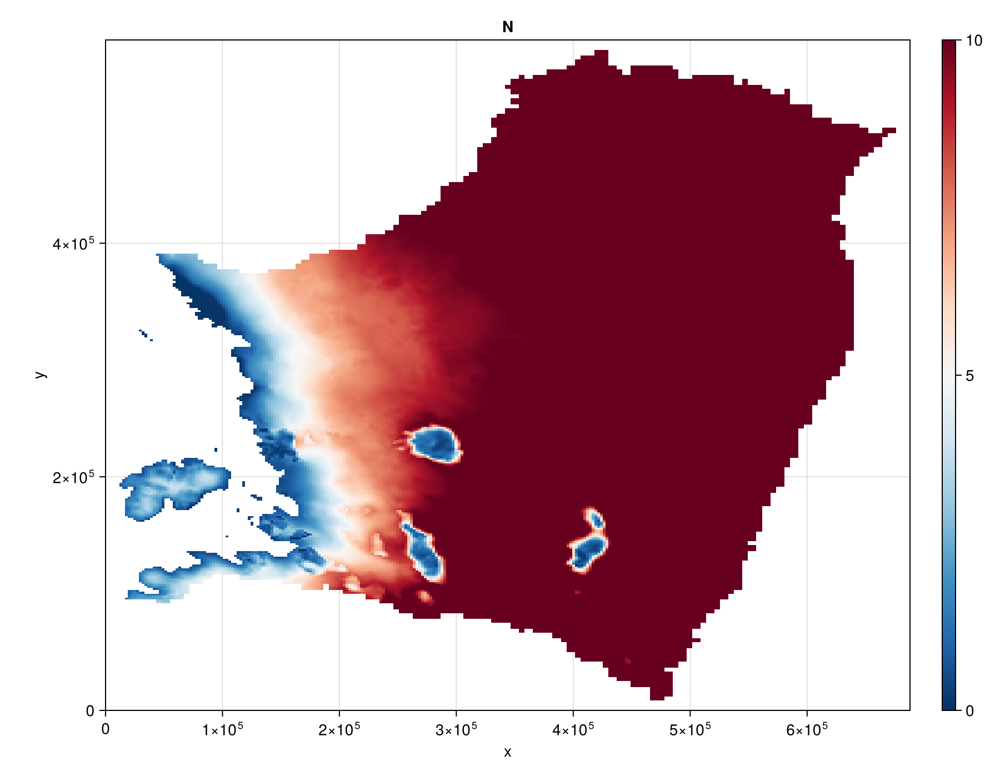

```@meta
EditURL = "HAB.jl"
```

# [Height above buoyancy (HAB)](@id HAB)
This is an example of how to run the FastHydrology.jl package for the steady state problem of the
HAB model, described in Sec. 2.1.1 of Kazmierczak et al 2022 (https://doi.org/10.5194/tc-16-4537-2022).

The figure below comes from running this model on the same Thwaites Amundsen-sector dataset used in
the [Kazmierczak et al 2024](@ref Kazmierczak2024) example.

## Reproducing this figure

As in the [Kazmierczak et al 2024](@ref Kazmierczak2024) example, this needs
`THWAITES2km_m3_HAB_toto.mat` placed at `docs/src/examples/input/Kazmierczak2024/`. Run the script
below directly with `julia` (it is shown for reference only -- the docs build does not execute it):

```julia
using FastHydrology
using CairoMakie

T = Float64
path = joinpath(@__DIR__, "input", "Kazmierczak2024", "THWAITES2km_m3_HAB_toto.mat")
Nx, Ny, xlims, ylims, mask, h, b, abs_v_b, A_visc, ṁ, κ = load_Kazmierczak(path)

# Prepare a grid using the Oceananigans rectilinear grid, and visualize it.
grid = OGRectHydroGrid(Nx, Ny, xlims, ylims; T = T)
fig = visualize_grid(grid)

# Build the model using the data from the input file above. The model holds its model-specific
# constants and fields, with the rest of the fields common to all models stored in the HydroState
# below.
model = HABHydroModel(grid)
state = HydroState(grid, mask, h, b)
sim   = SteadyStateSimulation(model, grid, state)
run!(sim)

# Rescale for plotting.
state.N .*= 1e-6 # makes N [MPa]
state.N .= mask_field(state.N, state.mask, NaN)

fig_N = visualize_field(state.N; plot_title = "N", transpose_data = true, colorrange = (0, 10))
```

## Result

Effective pressure N [MPa]:



````@example HAB
nothing #hide
````

