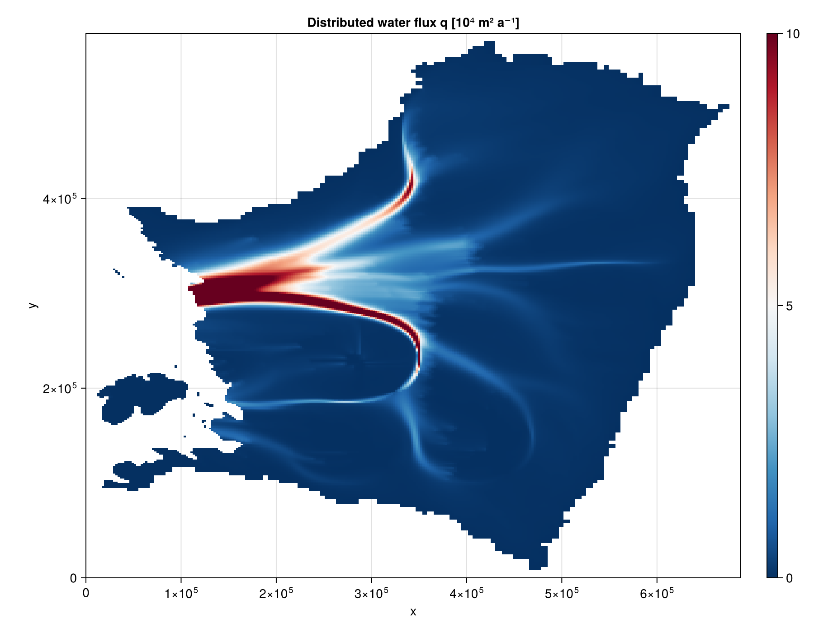
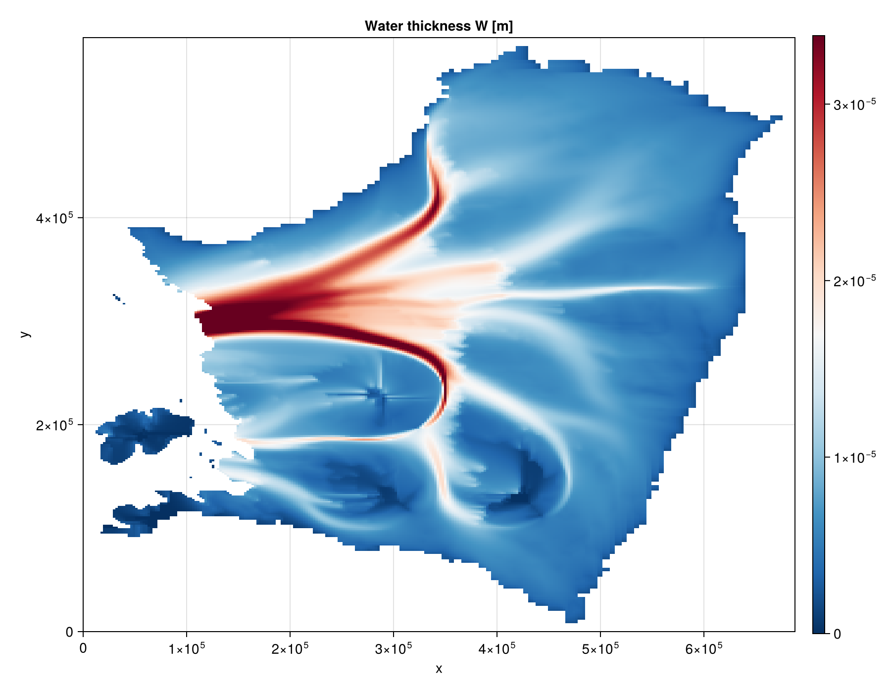
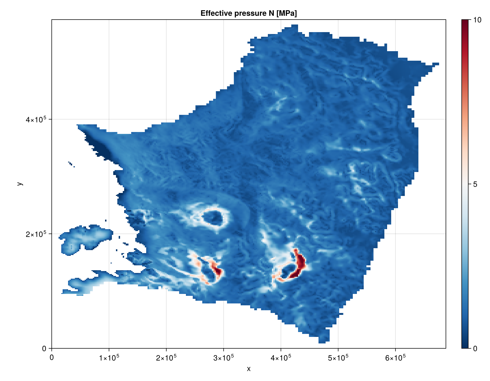
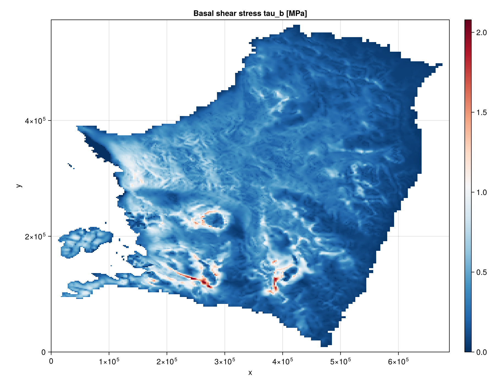

```@meta
EditURL = "Kazmierczak2024.jl"
```

# [Kazmierczak et al 2024](@id Kazmierczak2024)
This is an example of how to run the FastHydrology.jl package for the steady state problem of
Kazmierczak et al 2024 (https://doi.org/10.5194/tc-18-5887-2024).

The figures below come from running this model on the Thwaites Amundsen-sector dataset used for
Fig. S3 of Kazmierczak et al 2024, on a hard bed (`bed_rheology = :hard`).

## Reproducing these figures

The input file (`THWAITES2km_m3_HAB_toto.mat`, ~90 MB) is not shipped with this repository, so that
cloning/installing FastHydrology.jl stays lightweight -- this page is built from the static figures
below rather than by running the pipeline live. To reproduce them yourself:

1. Obtain `THWAITES2km_m3_HAB_toto.mat` and place it at
   `docs/src/examples/input/Kazmierczak2024/THWAITES2km_m3_HAB_toto.mat`.
2. Run the script below directly with `julia` (it is shown for reference only -- the docs build
   does not execute it):

```julia
using FastHydrology
using CairoMakie

T = Float64
path = joinpath(@__DIR__, "input", "Kazmierczak2024", "THWAITES2km_m3_HAB_toto.mat")
Nx, Ny, xlims, ylims, mask, h, b, abs_v_b, A_visc, G, q_T, ṁ, κ = load_Kazmierczak(path; bed_rheology = :hard)

# Prepare a grid using the Oceananigans rectilinear grid, and visualize it.
grid = OGRectHydroGrid(Nx, Ny, xlims, ylims; T = T)
fig = visualize_grid(grid)

# Build the model using the data from the input file above. The model holds its model-specific
# fields, with the rest of the fields common to all models stored in the HydroState below.
#
# By default, the water source feeding the flux-routing algorithm includes the dissipation melt
# rate generated by the flux itself as it moves down the hydraulic gradient (`dissipation_melt =
# true`) -- a term Kazmierczak et al 2024 drop as negligible but which is kept here for
# generality. It can be turned off with `dissipation_melt = false` to reproduce the paper's
# original water balance exactly. We also silence the per-call Picard convergence printout here
# with `dissipation_verbose = false`.
#
# `longcoupwater` (the stress-gradient-coupling smoothing width) has no safe default that works
# for every grid resolution, so it must be passed explicitly or `KazmierczakHydroModel` warns and
# falls back to 5.0 -- see its docstring for how to choose a value from your own grid's resolution
# relative to ice thickness. 5.0 is appropriate for this dataset's 2 km grid.
#
# `state.W`'s closure (`water_thickness_algorithm`, default `DarcyWeisbachThickness()`) and its
# numerical-safety bounds (`Wmin`/`Wmax`/`q_max`/`sigmat`, all no-op by default -- nothing is
# clamped unless you ask for it) are left at their defaults here; see the API reference for the
# other closures (`ArealConduitThickness`, `LaminarThickness`) and KORI-ULB's own bound values.
model = KazmierczakHydroModel(grid, κ, abs_v_b, A_visc, ṁ; longcoupwater = 5.0, dissipation_verbose = false)
state = HydroState(grid, mask, h, b)
sim   = SteadyStateSimulation(model, grid, state)
run!(sim)

# Rescale for plotting.
model.q .*= perSecond2perYear(1.0) / 1e4 # makes q [10⁴ m² a⁻¹]
state.N .*= 1e-6 # makes N [MPa]
model.q .= mask_field(model.q, state.mask, NaN)
state.N .= mask_field(state.N, state.mask, NaN)
state.W .= mask_field(state.W, state.mask, NaN)

fig_q = visualize_field(model.q; plot_title = "Distributed water flux q [10⁴ m² a⁻¹]", transpose_data = true, colorrange = (0, 10))
fig_W = visualize_field(state.W; plot_title = "Water thickness W [m] (DarcyWeisbachThickness)", transpose_data = true, colorrange = extrema(filter(!isnan, state.W.data)))
fig_N = visualize_field(state.N; plot_title = "Effective pressure N [MPa]", transpose_data = true, colorrange = (0, 10))

# ## Adding a basal sliding law
#
# By default `sliding_law = PrescribedFrictionSlidingLaw()`, so `mdot_in` alone is assumed to already
# be the complete melt rate. Passing a pressure-dependent sliding law instead adds the
# frictional-heating term tau_b*v_b/L_w (Eq. 3 of Kazmierczak et al 2024) on top of it, computed from
# a basal shear stress `tau_b(N, v_b)`. Since tau_b then depends on the effective pressure N, which is
# itself downstream of q, `resolve_q!` widens its Picard loop to solve for q and N jointly rather than
# nesting a second loop around the first -- see the `sliding_law` keyword on `KazmierczakHydroModel`
# and `resolve_q!`'s docstring for the physics and the loop design.
#
# `PowerPlasticSlidingLaw` and `RegularizedCoulombSlidingLaw` are written to match the two sliding
# laws implemented in Yelmo.jl's `basal_dragging.jl` (`beta_method` 1/2/4 and 3/5 respectively), so
# a future ice-dynamics coupling can configure both sides with numerically matching laws. The
# parameters below (`c_till`, `q`, `u0`) are illustrative, not calibrated to Thwaites.
#
# ṁ above is `load_Kazmierczak`'s `Bmelt` field: KORI-ULB's own converged melt-rate output for this
# Thwaites run, which already bakes in that model's own frictional-heating estimate. Attaching a real
# sliding law to it would add tau_b*v_b/L_w a second time unless we say so explicitly --
# `mdot_includes_friction = true` tells `resolve_q!` to skip that addition while still computing
# `tau_b`/`N` from `sliding_law` every sweep, so the `(q, N)` coupling loop (and `tau_b` itself, below)
# are unaffected.
sliding_law = RegularizedCoulombSlidingLaw(c_till = 0.5, q = 1/3, u0 = perYear2perSecond(100.0))
model_sliding = KazmierczakHydroModel(grid, κ, abs_v_b, A_visc, ṁ;
                                       sliding_law = sliding_law, longcoupwater = 5.0,
                                       mdot_includes_friction = true,
                                       dissipation_verbose = false, coupling_verbose = false)
state_sliding = HydroState(grid, mask, h, b)
run!(SteadyStateSimulation(model_sliding, grid, state_sliding))

model_sliding.tau_b .*= 1e-6 # makes tau_b [MPa]
model_sliding.tau_b .= mask_field(model_sliding.tau_b, state_sliding.mask, NaN)
fig_tau_b = visualize_field(model_sliding.tau_b; plot_title = "Basal shear stress tau_b [MPa]", transpose_data = true, colorrange = extrema(filter(!isnan, model_sliding.tau_b.data)))

# ## Computing the melt rate faithfully from Eq. 3
#
# `mdot_includes_friction` above avoids double-counting only *within* FastHydrology's own accounting
# -- it doesn't compute a friction-free melt rate for you. If you'd rather have FastHydrology own the
# melt-rate physics end-to-end, faithfully to Eq. 3 (background term `(G - q_T)/L_w`, with the
# frictional-heating and dissipation terms added on top dynamically, same as above but without
# needing `mdot_includes_friction`), use the other `KazmierczakHydroModel` constructor: `G` and `q_T`
# (both [W/m^2]) instead of ṁ. `load_Kazmierczak` returns a real geothermal flux field `G`; it has no
# `q_T` field of its own, so `load_Kazmierczak` returns it as zero everywhere (the usual
# temperate-bed assumption) -- both are mandatory arguments precisely so that assumption has to be
# made explicit, not silent.
model_from_G = KazmierczakHydroModel(grid, κ, abs_v_b, A_visc, G, q_T;
                                      sliding_law = sliding_law, longcoupwater = 5.0,
                                      dissipation_verbose = false, coupling_verbose = false)
state_from_G = HydroState(grid, mask, h, b)
run!(SteadyStateSimulation(model_from_G, grid, state_from_G))
```

## Results

Distributed water flux q [10⁴ m² a⁻¹]:



Water thickness W [m]:



Effective pressure N [MPa]:



Basal shear stress tau_b [MPa], with `RegularizedCoulombSlidingLaw`:



````@example Kazmierczak2024
nothing #hide
````

